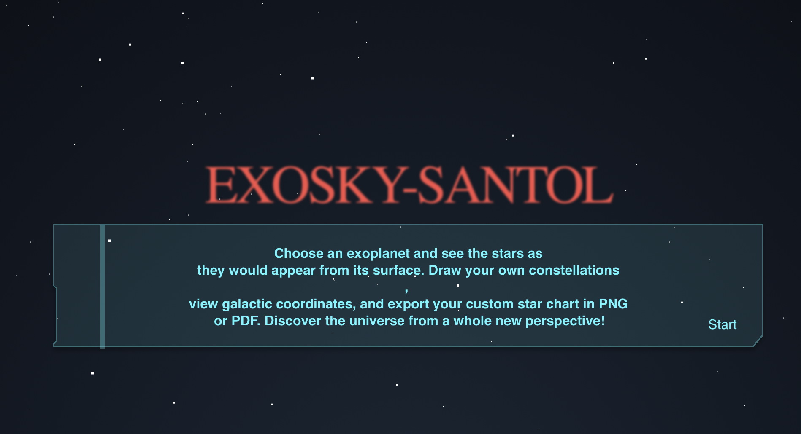

# Exosky-NASA

 <!-- Optional -->

Our project website is available at: https://nasa-exosky.vercel.app

## 🚀 Project Description

Our project aims to simulate a sky view from any exoplanet in the NASA database. We provide an exquisitely designed user interface, allowing users to change their viewing angle, enjoy a photo-realistic sky map, and create their constellations by joining some pairs of stars. We use Gaia earth-centric databases to approximate the viewing angle and the visible star field of the selected exoplanet and utilize advanced coordination transformation to calculate the stars’ position.

## 🛠️ Technologies Used

- **Language:** JavaScript, Python
- **Framework:** React, Fastapi

## 📦 Installation

If you wish to build the environment on your local device, please follow the instructions below:

1. Clone the repository:
   ```bash
   git clone https://github.com/tinger529/Exosky-NASA.git
   ```
2. Navigate to the project directory:
   ```bash
   cd Exosky-NASA
   ```
3. To run frontend and backend server, please refer to the readme file in frontend/backend directories.

## Notes
Loading stars may leads to some latency, this is due to the query time to the Gaia dataset, and it is not a implementation problem. We may add loading page in the future.

## ⭐ Support
If you like this project, please consider giving it a ⭐ on GitHub! It helps others find the project and shows your support, thank you!